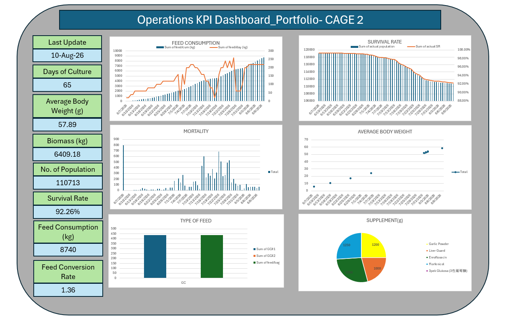

# operations-kpi-dashboard
Excel-based Operations KPI Dashboard
# Operations KPI & Inventory Dashboard

## Overview

An Excel-based operations dashboard developed to monitor operational KPIs, inventory performance, feed usage, and production trends.

This project demonstrates practical skills in data analysis, data visualization, KPI reporting, inventory monitoring, and dashboard development using Microsoft Excel.

## Objectives

* Monitor operational KPIs
* Analyze inventory usage and trends
* Track feed consumption
* Monitor production performance
* Visualize operational trends
* Reduce manual reporting effort

## Tools Used

* Microsoft Excel
* PivotTables
* PivotCharts
* Excel formulas
* Slicers
* Data validation
* Dashboard development
* Data analysis and visualization

## Key Analysis

### Operational Performance

The dashboard provides an overview of operational KPIs and performance trends to support management monitoring and decision-making.

### Inventory Analysis

Inventory usage and stock movement are analyzed to identify trends, potential discrepancies, and areas requiring attention.

### Feed Usage

Feed consumption is visualized to monitor usage patterns and support operational planning.

### Production Trends

Production performance is analyzed over time using interactive charts and KPI indicators.

## Key Result

Developed an Excel-based dashboard that reduced reporting preparation time by approximately 30% by consolidating operational data and visualizations into a centralized reporting dashboard.

## Dataset

The dataset used in this portfolio is simulated/anonymized for demonstration and portfolio purposes. No confidential company information is included.

## Dashboard Preview

## Skills Demonstrated

* Data Analysis
* Data Visualization
* KPI Reporting
* Inventory Analysis
* Dashboard Development
* Microsoft Excel
* PivotTables
* PivotCharts
* Data Cleaning
* Operational Reporting
* Process Improvement
